# bolt-hackathon-badge

Badges & logo for the World's Largest Hackathon sponsored by [Bolt.new](https://bolt.new/)

- [Bolt](https://bolt.new/)
- [Hackathon Website](https://hackathon.dev/)
- [Hackathon Rules](https://worldslargesthackathon.devpost.com/rules)
- [Hackathon Badge Guidelines](https://worldslargesthackathon.devpost.com/details/badgeguidelines)
- [Hackathon Badge Google Drive](https://drive.google.com/drive/folders/1iNALInxyPJl7IHP5iywUKqsdumCrWIA0)
- [The Chainsmokers (Badge Example)](https://thechainsmokers.com/)

## Why Badge & Logos?

Part of the requirement for the hackathon is the use of the Bolt.new badge:

> "The publicly deployed version of the Project interface must include a badge that highlights that it is built with Bolt.new."

## Badge Guidelines

As of June 12th, 2025 9:30AM Pacific:

> Here are some guidelines:
>
> **Mandatory Inclusion:** All submitted projects must display the Bolt.new badge on their publicly deployed version.  
> **Visibility:** The badge must be clearly visible to the public on the main home page.  
> **Placement:** Use your best judgement for your project's branding but we recommend placing the badge in the top right (as seen in the above example) or bottom right.  
> **Sizing:** The badge should be scalable and responsive to different screen sizes.  
> **Hyperlink:** All badges must hyperlink to [https://bolt.new/](https://bolt.new/).  
> **Badge Variations:**  
> - **White Circle:** Use on dark backgrounds for visibility.  
> - **Black Circle:** Use on light backgrounds for visibility.  
> - **Text Only:** Use on dark backgrounds if preferred over the circle for your project's branding.  
> **Files:** Shared in [public Drive Folder here](https://drive.google.com/drive/folders/1iNALInxyPJl7IHP5iywUKqsdumCrWIA0)

## What's In This Repo?

This repo contains PNG, WEBP, & SVG versions of the badge image. It also contains SVG images of the Hackathon Sponsor logos.

## How Do I Use This?

Easy! You can download the images and simply add them in your project in Bolt.

## Will This Use Tokens?

No tokens! Download this repository and add the files you want manually to your project using the "Code" view. You can drag and drop files in and it does not cost any tokens.

If you are not certain where to upload the files and want to ask the AI make sure you are in "Discussion" mode and AI will tell you what folder to put the badge & logos in and it will use less tokens for the answer.

## Are These Official Assets?

The PNG images are taken directly from the [official Google Drive link](https://drive.google.com/drive/folders/1iNALInxyPJl7IHP5iywUKqsdumCrWIA0) shared by the hackathon.

The SVG & WEBP images were created by [@kickiniteasy](https://x.com/kickiniteasy)

## Badge Asset Gallery

Below are previews of the available Bolt badge assets. (If an image does not appear, the file is missing.)

### White Circle Badge
<table><tr>
<td style="background:#222; text-align:center;">
PNG
</td>
<td style="background:#222; text-align:center;">
SVG
</td>
<td style="background:#222; text-align:center;">
WEBP
</td>
</tr></table>

### Black Circle Badge
<table><tr>
<td style="background:#f3f3f3; text-align:center;">
PNG
</td>
<td style="background:#f3f3f3; text-align:center;">
SVG
</td>
<td style="background:#f3f3f3; text-align:center;">
WEBP
</td>
</tr></table>

### Logotext "Powered by Bolt.new"
<table><tr>
<td style="background:#222; text-align:center;">
PNG
</td>
<td style="background:#222; text-align:center;">
SVG
</td>
<td style="background:#222; text-align:center;">
WEBP
</td>
</tr></table>

## Sponsor Logos

Logos for the sponsors listed below are included in this repository for convenience and reference. Where available, the official brand guide or asset link is provided.

Logos were sourced from official brand resources or public brand guides, and are intended for use in accordance with each sponsor's branding guidelines. If a sponsor did not provide a brand guide, only the name is listed.

- [Algorand](https://algorandtechnologies.com/about/media-kit/)
- Anthropic
- [ElevenLabs](https://elevenlabs.io/brand)
- Entri
- Netlify
- [Reddit](https://redditinc.com/brand)
- Revenuecat
- [Supabase](https://supabase.com/brand-assets)
- Tavus

## Sponsor Asset Inventory

Below are two tables showing which logo and wordmark files exist for each sponsor. ✅ = present, ❌ = missing.

### Logo Files
| Sponsor     | logo-color.svg | logo-black.svg | logo-white.svg |
|-------------|:--------------:|:--------------:|:--------------:|
| Algorand    | ✅             | ✅             | ✅             |
| Anthropic   | ✅             | ✅             | ✅             |
| ElevenLabs  | ✅             | ✅             | ✅             |
| Entri       | ✅             | ✅             | ✅             |
| Netlify     | ✅             | ✅             | ✅             |
| Reddit      | ✅             | ✅             | ✅             |
| Revenuecat  | ✅             | ✅             | ✅             |
| Supabase    | ✅             | ✅             | ✅             |
| Tavus       | ✅             | ✅             | ✅             |

### Wordmark Files
| Sponsor     | wordmark-color.svg | wordmark-black.svg | wordmark-white.svg |
|-------------|:------------------:|:------------------:|:------------------:|
| Algorand    | ✅                 | ✅                 | ✅                 |
| Anthropic   | ✅                 | ✅                 | ✅                 |
| ElevenLabs  | ✅                 | ✅                 | ✅                 |
| Entri       | ✅                 | ✅                 | ✅                 |
| Netlify     | ✅                 | ✅                 | ✅                 |
| Reddit      | ✅                 | ✅                 | ✅                 |
| Revenuecat  | ✅                 | ✅                 | ✅                 |
| Supabase    | ✅                 | ✅                 | ✅                 |
| Tavus       | ✅                 | ✅                 | ✅                 |

---

## Sponsor Asset Gallery

Below are previews of the available SVG logo and wordmark assets for each sponsor. (If an image does not appear, the file is missing.)

### Algorand
**Logos:**

<table><tr>
<td style="background:#f3f3f3;"></td>
<td style="background:#f3f3f3;"></td>
<td style="background:#f3f3f3;">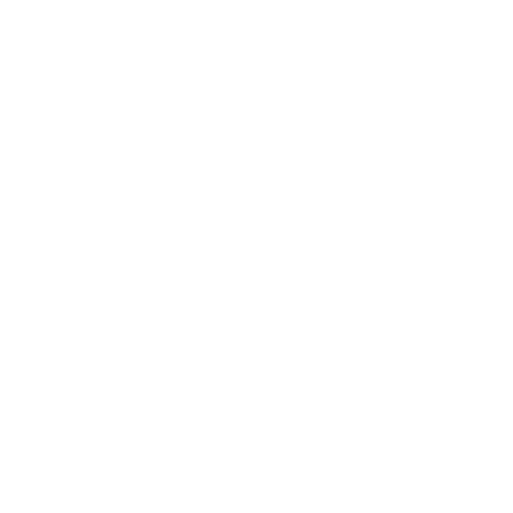</td>
</tr></table>

**Wordmarks:**
<table><tr>
<td style="background:#f3f3f3;"></td>
<td style="background:#f3f3f3;"></td>
<td style="background:#f3f3f3;">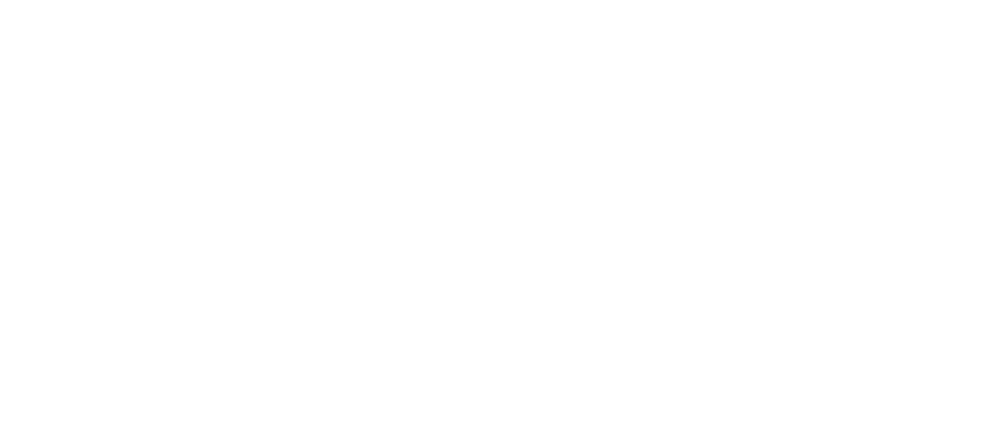</td>
</tr></table>

---

### Anthropic
**Logos:**
<table><tr>
<td style="background:#f3f3f3;"></td>
<td style="background:#f3f3f3;"></td>
<td style="background:#f3f3f3;"></td>
</tr></table>

**Wordmarks:**
<table><tr>
<td style="background:#f3f3f3;"></td>
<td style="background:#f3f3f3;"></td>
<td style="background:#f3f3f3;"></td>
</tr></table>

---

### ElevenLabs
**Logos:**
<table><tr>
<td style="background:#f3f3f3;"></td>
<td style="background:#f3f3f3;"></td>
<td style="background:#f3f3f3;">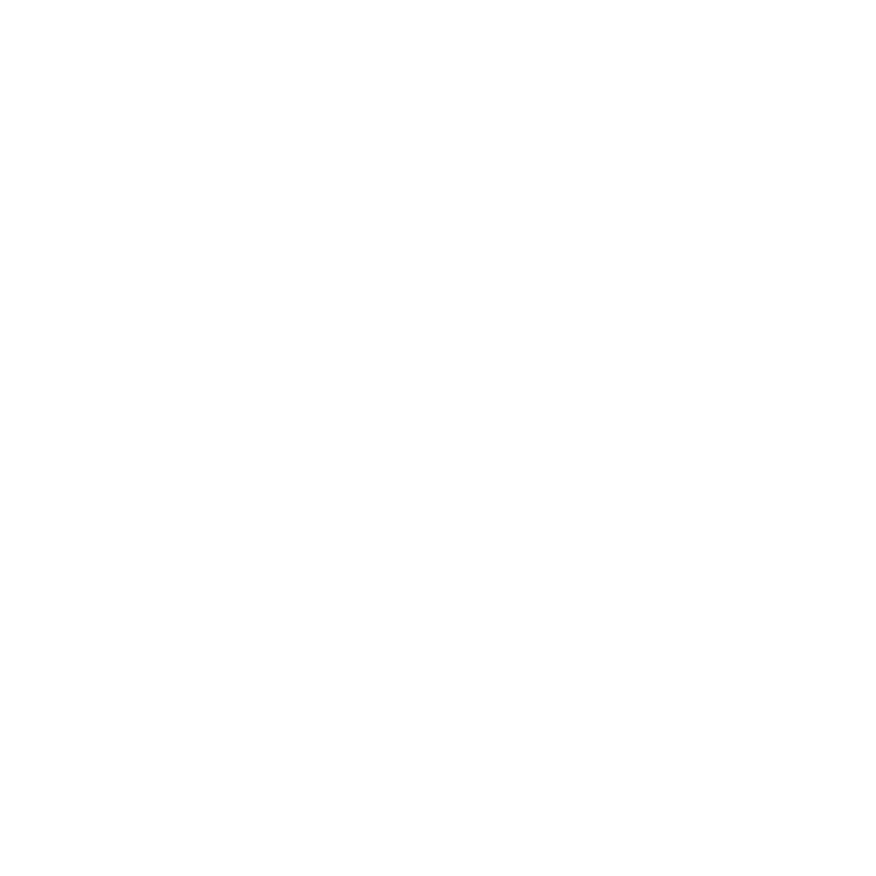</td>
</tr></table>

**Wordmarks:**
<table><tr>
<td style="background:#f3f3f3;"></td>
<td style="background:#f3f3f3;"></td>
<td style="background:#f3f3f3;">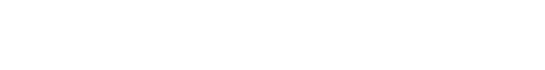</td>
</tr></table>

---

### Entri
**Logos:**
<table><tr>
<td style="background:#f3f3f3;">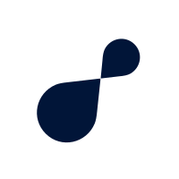</td>
<td style="background:#f3f3f3;"></td>
<td style="background:#f3f3f3;">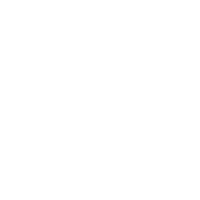</td>
</tr></table>

**Wordmarks:**
<table><tr>
<td style="background:#f3f3f3;"></td>
<td style="background:#f3f3f3;"></td>
<td style="background:#f3f3f3;"></td>
</tr></table>

---

### Netlify
**Logos:**
<table><tr>
<td style="background:#f3f3f3;"></td>
<td style="background:#f3f3f3;"></td>
<td style="background:#f3f3f3;">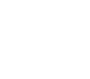</td>
</tr></table>

**Wordmarks:**
<table><tr>
<td style="background:#f3f3f3;">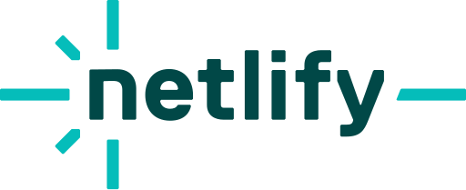</td>
<td style="background:#f3f3f3;"></td>
<td style="background:#f3f3f3;"></td>
</tr></table>

---

### Reddit
**Logos:**
<table><tr>
<td style="background:#f3f3f3;"></td>
<td style="background:#f3f3f3;"></td>
<td style="background:#f3f3f3;"></td>
</tr></table>

**Wordmarks:**
<table><tr>
<td style="background:#f3f3f3;">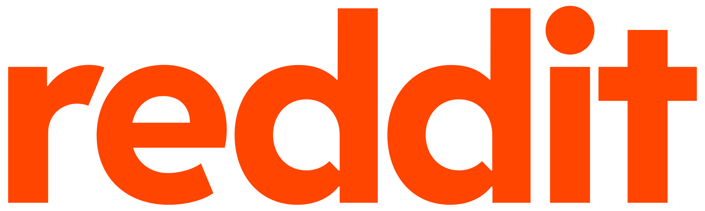</td>
<td style="background:#f3f3f3;"></td>
<td style="background:#f3f3f3;"></td>
</tr></table>

---

### Revenuecat
**Logos:**
<table><tr>
<td style="background:#f3f3f3;">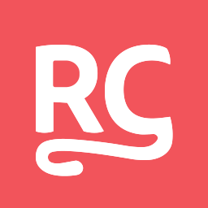</td>
<td style="background:#f3f3f3;"></td>
<td style="background:#f3f3f3;">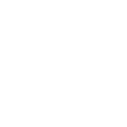</td>
</tr></table>

**Wordmarks:**
<table><tr>
<td style="background:#f3f3f3;"></td>
<td style="background:#f3f3f3;"></td>
<td style="background:#f3f3f3;"></td>
</tr></table>

---

### Supabase
**Logos:**
<table><tr>
<td style="background:#f3f3f3;"></td>
<td style="background:#f3f3f3;"></td>
<td style="background:#f3f3f3;"></td>
</tr></table>

**Wordmarks:**
<table><tr>
<td style="background:#f3f3f3;"></td>
<td style="background:#f3f3f3;"></td>
<td style="background:#f3f3f3;"></td>
</tr></table>

---

### Tavus
**Logos:**
<table><tr>
<td style="background:#f3f3f3;"></td>
<td style="background:#f3f3f3;"></td>
<td style="background:#f3f3f3;"></td>
</tr></table>

**Wordmarks:**
<table><tr>
<td style="background:#f3f3f3;"></td>
<td style="background:#f3f3f3;"></td>
<td style="background:#f3f3f3;"></td>
</tr></table>

---